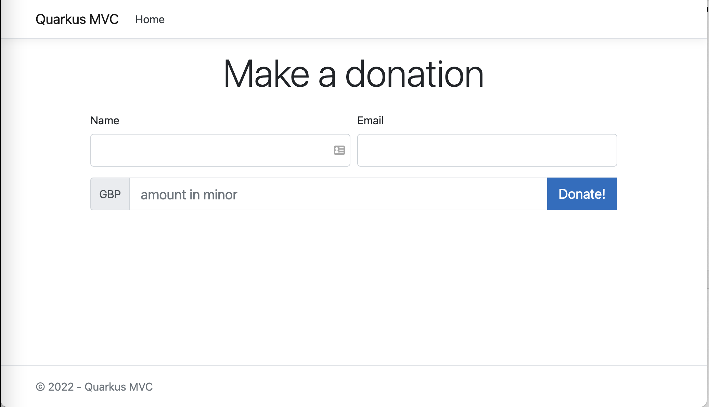

# Quarkus MVC example project

A simple MVC project based on [Quarkus](https://quarkus.io), that comes with a UI to send donations and setup payment mandates
via TrueLayer Payments API.




## Requirements

To run the project it is enough to have Java 11 installed with  with `JAVA_HOME` environment variable configured appropriately;

## Configuration

This sample project leverages [Quarkus configuration framework](https://quarkus.io/guides/config) to specify the client 
credentials and signing options required to initialise the TrueLayer client.

In this sample application the client is configured for TrueLayer Sandbox environment. Make sure that you're
using a proper set of Sandbox credentials or switch to your desired environment in [`TrueLayerClientProvider.java`](./src/main/java/com/truelayer/quarkusmvc/TrueLayerClientProvider.java#L33) class.

The easiest way to setup the project with your credentials is to fill the [application.properties](./src/main/resources/application.properties) file or
set the following environment variables: 
- `TL_CLIENT_ID`
- `TL_CLIENT_SECRET`
- `TL_SIGNING_KEY_ID`
- `TL_SIGNING_PRIVATE_KEY_LOCATION`
In addition, make sure to properly configure the redirect URI in the [DonationService.createDonationLink()](./src/main/java/com/truelayer/quarkusmvc/services/DonationService.java#L71) method, so that the value is one of the redirect URIs set as allowed in your Console Application:
```java
return tlClient.hpp().getHostedPaymentPageLink(paymentResponse.getData().getId(), paymentResponse.getData().getResourceToken(),
                URI.create("<redirect_url>"));
```

Make sure to whitelist the `<redirect_url>` value in your TrueLayer console.

## Running the application

To run the application, simply execute the following gradle task from the root directory of this sample project: 

```shell
./gradlew quarkusDev
```

Alternatively, you can load the project in your favorite IDE and rely on IDE plugins to boot the application.

## Testing the application

Browse to http://localhost:8080/donations or http://localhost:8080/subscriptions